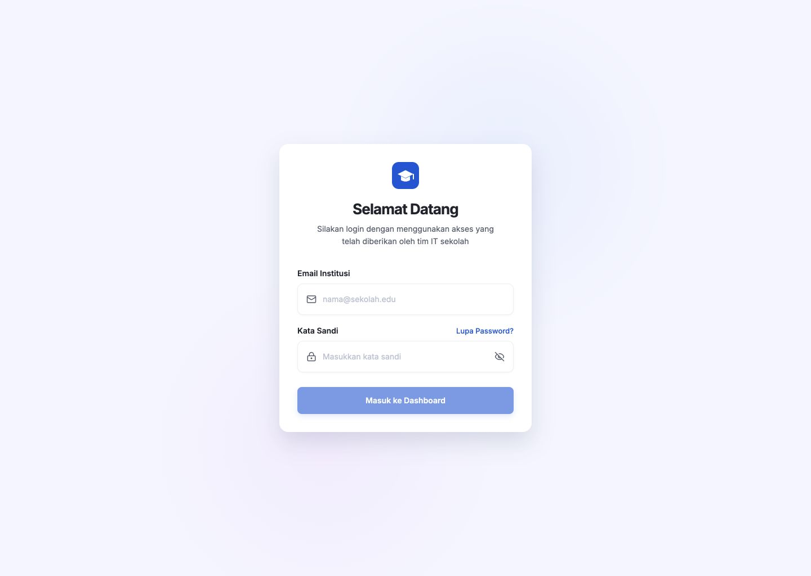
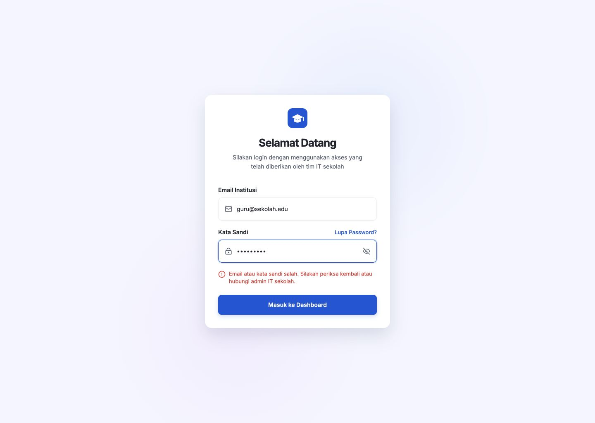

# Laporan Implementasi Login EduTrack

## 1. Komponen yang dibuat

- `AuthCard`: shell card autentikasi yang dipakai ulang oleh login dan lupa kata sandi.
- `FormInput`: input berlabel, ikon, error field, dan action di sisi kanan.
- `LoginErrorMessage`: pesan kegagalan autentikasi dengan `role="alert"`.
- `Button` dan `Spinner`: tombol reusable untuk state normal, disabled, dan loading.
- `LoginPage`: validasi form, show/hide password, mock login, loading, error, dan redirect berdasarkan role.
- `ForgotPasswordPage`: form reset kata sandi dengan pesan aman yang tidak membocorkan status akun.
- `ProtectedRoute` dan `RoleRoute`: proteksi autentikasi dan pembatasan role.

## 2. Route

- `/login`
- `/forgot-password`
- `/dashboard`
- `/teacher/dashboard` setelah login sebagai Guru
- `/403`
- `*` untuk 404

Route `/` mengarahkan pengguna ke `/login`.

## 3. Cara menjalankan

```bash
npm install
npm run dev
```

Build production:

```bash
npm run build
```

## 4. Akun demo

| Role | Email | Kata sandi |
|---|---|---|
| Administrator | `admin@sekolah.edu` | `Admin123!` |
| Guru | `guru@sekolah.edu` | `Guru123!` |
| Siswa | `siswa@sekolah.edu` | `Siswa123!` |

## 5. Validasi

- Email wajib diisi dan harus berformat email valid.
- Kata sandi wajib diisi dan minimal 8 karakter.
- Tombol submit disabled sampai form valid.
- Gagal autentikasi mempertahankan email, memfokuskan input kata sandi, dan menghapus pesan error ketika input diperbaiki.
- Request login memiliki delay 850 ms, state loading, input disabled, dan proteksi double submit.

## 6. Perbedaan kecil dari referensi

- Logo dibuat sebagai SVG lokal agar tajam pada semua kepadatan layar.
- Background memakai dua radial gradient lembut di atas warna dasar `#F4F5FF`.
- Font Inter dimuat dari Google Fonts dengan fallback Arial; jika jaringan tidak tersedia, fallback dipakai otomatis.
- Ukuran card menyesuaikan layar kecil dan tetap mempertahankan struktur visual referensi.

## 7. Screenshot login normal



## 8. Screenshot login error



## 9. Pengujian responsive

Status: **Lulus**.

Viewport yang diverifikasi: 1440×1024, 1280×800, 1024×768, 768×1024, 430×932, 390×844, dan 360×800. Login tetap berada di tengah, card tidak melebihi viewport, label password tidak bertabrakan dengan link, dan tidak ada horizontal scroll pada halaman autentikasi.

## 10. Keyboard accessibility

Status: **Lulus**.

- Semua input mempunyai label dan hubungan `aria-describedby` saat error.
- Show/hide password mempunyai label aksesibel dinamis.
- Submit dapat dijalankan dengan Enter.
- Focus ring terlihat.
- Error autentikasi diumumkan sebagai alert.
- Fokus kembali ke kata sandi setelah login gagal.

## Hasil verifikasi teknis

- `npm run build`: lulus.
- Console browser: tidak ada error atau warning.
- Login benar, login salah, forgot password, logout, redirect, dan proteksi route: lulus.
