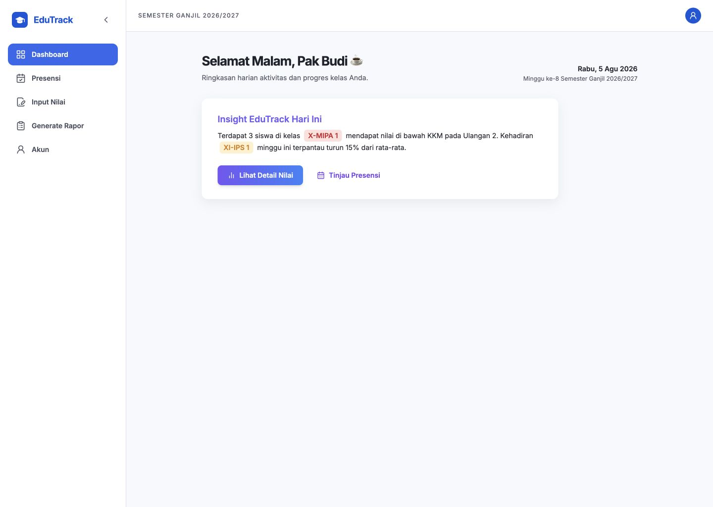
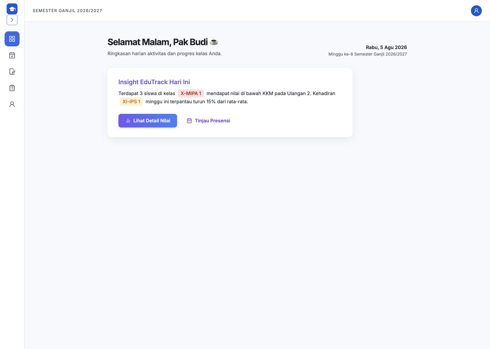
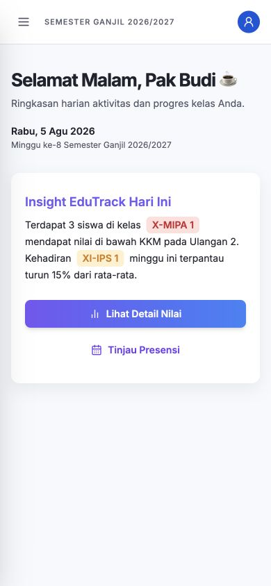
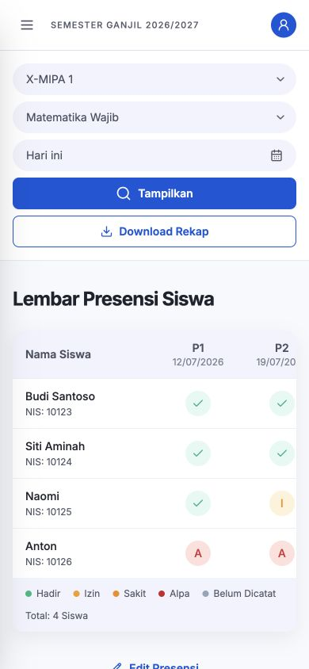
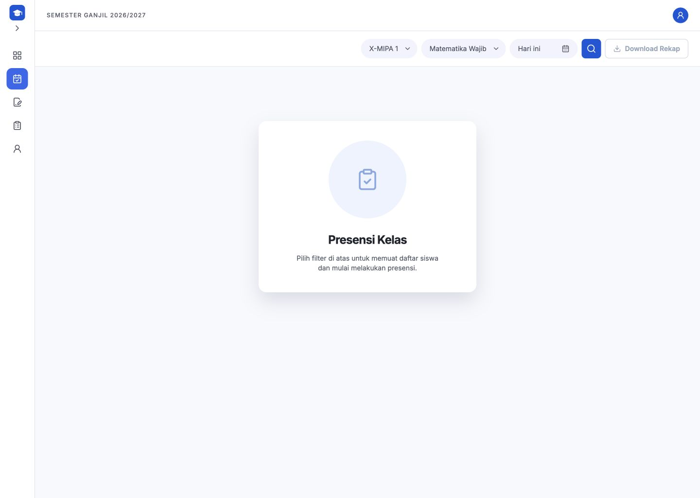
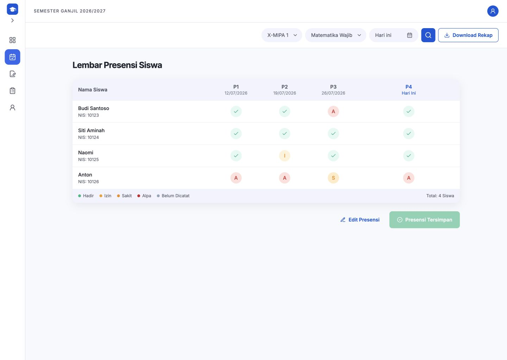

# Laporan Implementasi Dashboard Guru EduTrack

## 1. Halaman yang dibuat

- `/teacher/dashboard`: greeting dinamis dan Insight EduTrack.
- `/teacher/attendance`: filter, empty/loading/error/loaded/validation/saving/success state, tabel, koreksi, dan CSV.
- `/teacher/grades`: placeholder Input Nilai.
- `/teacher/reports`: placeholder Generate Rapor Mapel.
- `/teacher/account`: profil Guru, role, dan daftar penugasan kelas-mapel.

## 2. Komponen reusable

### Layout

- `DashboardLayout`, `Sidebar`, `SidebarItem`, `MobileSidebar`, `Topbar`, `UserMenu`.

### Dashboard

- `DashboardGreeting`, `InsightCard`, `InsightBadge`.

### Presensi

- `AttendanceFilters`, `AttendanceEmptyState`, `AttendanceTable`, `AttendanceStatusSelector`, `AttendanceStatusBadge`, `AttendanceLegend`, `SaveAttendanceButton`.

### UI

- `Button`, `Select`, `DatePicker`, `DropdownMenu`, `Modal`, `Toast`, `Spinner`, `EmptyState`.

## 3. Route

- `/teacher/dashboard`
- `/teacher/attendance`
- `/teacher/grades`
- `/teacher/reports`
- `/teacher/account`

Seluruh route Guru berada di bawah `ProtectedRoute`, `RoleRoute`, dan `DashboardLayout`.

## 4. Cara menjalankan

```bash
npm install
npm run dev
```

Gunakan `npm run build` untuk build production.

## 5. Akun demo

- Email: `guru@sekolah.edu`
- Kata sandi: `Guru123!`
- Role: `teacher`
- Penugasan: X-MIPA 1 dan XI-IPS 1, Matematika Wajib, Semester Ganjil 2026/2027.

## 6. Alur login sampai presensi tersimpan

1. Login dengan akun Guru.
2. Sistem mengarahkan ke `/teacher/dashboard`.
3. Buka menu Presensi.
4. Pilih kelas, mata pelajaran, dan tanggal lalu tekan Tampilkan.
5. Pilih satu status eksplisit untuk setiap siswa: Hadir, Izin, Sakit, atau Alpa.
6. Jika masih ada `NOT_RECORDED`, sistem menampilkan toast error dan memfokuskan siswa pertama yang belum diisi.
7. Tekan Simpan Presensi; service mock menyimpan data setelah delay 800 ms.
8. Segmented control berubah menjadi badge dan status hijau “Presensi Tersimpan”.
9. Edit Presensi meminta alasan minimal 5 karakter dan menyimpan audit perubahan.

## 7. Sidebar expanded dan collapsed

- Expanded: lebar 255 px dengan ikon dan label.
- Collapsed: lebar 72 px, ikon terpusat, tooltip native/custom, dan chevron berubah arah.
- Transisi menggunakan durasi 200 ms.
- Active state mengikuti `NavLink` dan current route.
- Di bawah breakpoint tablet/mobile, sidebar permanen diganti drawer dengan overlay.
- Drawer dapat ditutup lewat overlay, tombol X, pilihan menu, atau Escape.





## 8. Penyimpanan localStorage

- `edutrack_user`: data pengguna aktif.
- `edutrack_demo_token`: token demo untuk proteksi route.
- `edutrack_sidebar_collapsed`: preferensi sidebar terakhir.
- `edutrack_attendance_records`: data presensi per kelas, mapel, tanggal, dan pertemuan.

Koreksi menyimpan status lama, status baru, pengguna, waktu, dan alasan di `correctionHistory`.

## 9. Pengujian responsive

Status: **Lulus**.

Viewport yang diverifikasi: 1440×1024, 1280×800, 1024×768, 768×1024, 430×932, 390×844, dan 360×800.

- Desktop: sidebar fixed, toolbar horizontal, content mengikuti lebar sidebar.
- Tablet: sidebar collapsed, filter wrap, dan content tetap terbaca.
- Mobile: drawer, header bertumpuk, filter satu kolom, tabel memiliki horizontal scroll internal, kolom nama sticky, dan tombol aksi full width.
- `body` tetap selebar viewport; overflow tabel terisolasi di container tabel.





## 10. Pengujian accessibility

Status: **Lulus**.

- Navigasi menggunakan `NavLink` dan active page diumumkan.
- Tombol sidebar, profil, filter, modal, serta selector status mempunyai accessible name.
- Selector status menggunakan button dan `aria-pressed`.
- Error memakai `role="alert"`; toast dan status sukses memakai `role="status"`.
- Escape menutup drawer, dropdown, dan modal.
- Fokus siswa belum lengkap dan focus ring telah diverifikasi.
- Status memakai ikon/huruf selain warna.

## 11. Perbedaan kecil dari referensi

- Greeting dan tanggal memakai waktu JavaScript aktual, bukan tanggal statis di gambar.
- Rapor memakai istilah bisnis “Rapor Mapel”.
- Sidebar collapsed memakai tooltip yang juga dapat muncul lewat focus keyboard.
- Toolbar mobile disusun vertikal agar target sentuh dan keterbacaan tetap baik.
- Legend memisahkan Izin dan Sakit sesuai aturan data, berbeda dari satu referensi yang menggabungkannya.

## 12. Fitur placeholder

- Input Nilai.
- Generate Rapor Mapel.
- Perubahan kata sandi pada halaman akun.

## Bukti presensi





## Hasil verifikasi teknis

- Build production: lulus.
- Console browser: 0 error dan 0 warning.
- CSV: header, UTF-8 BOM, serta mapping Hadir/Izin/Sakit/Alpa lulus pemeriksaan.
- Proteksi role: akun admin dialihkan ke `/403` saat membuka route Guru.
- Proteksi logout: route Guru kembali mengarahkan ke `/login` setelah sesi dihapus.
